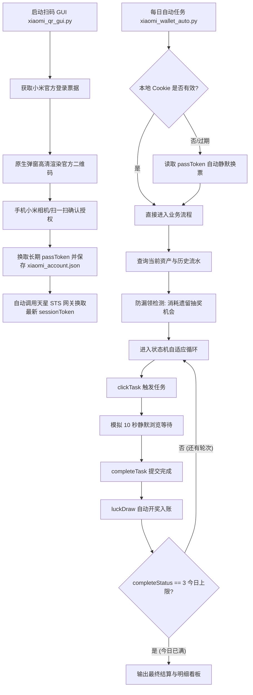

# 小米钱包“玩家视界”自动做任务领会员 (Xiaomi Wallet VIP Auto)

[](https://www.python.org/)
[](LICENSE)
[]()
[]()

> **轻量、优雅且强大的小米钱包“玩家视界”每日福利自动化助手。**  
> 告别繁琐的手动抓包与模拟器！支持 **桌面原生扫码登录** 与 **STS 票据自动自愈**，配合 **自适应任务状态机** 自动拿满每日视频会员时长。

---

## 🌟 核心亮点与痛点解决

| 传统自动化方案 | 本项目方案 |
| :--- | :--- |
| ❌ 需要 Fiddler / Charles / 模拟器抓包提取临时 Cookie | ✅ **首创桌面原生 GUI 扫码登录**，自动换取长期凭据 |
| ❌ 临时 Cookie 仅有 3 天有效期，需频繁重新抓包 | ✅ **STS 网关自动自愈**：利用 passToken（数月有效）自动静默换发业务 Cookie |
| ❌ 控制台打印字符二维码因终端字体行距拉伸导致手机无法对焦 | ✅ **独立置顶图形弹窗**，高清渲染小米官方原生二维码，扫码一次即可确认 |
| ❌ 接口返回图片链接被重复编码，导致“扫码打开另一个二维码”套娃 | ✅ **直通小米账号核心授权协议**，扫码直接调起手机系统【允许登录】弹窗 |
| ❌ 死板固定 2 轮循环，真机环境下浪费剩余轮次 | ✅ **智能状态机驱动**（逆向分析 completeStatus=0~4），自适应完成 2~5 轮任务 |
| ❌ 领奖与抽奖分离，异常中断容易导致抽奖机会遗失 | ✅ **内置防漏领机制**，启动时自动检测并消耗 remainChance > 0 遗留奖励 |
| ❌ 无明细反馈，不知道领了多少 | ✅ **内置今日账目流水看板**，直观展示每一次入账时间与具体时长 |

---

## 🏗️ 架构与核心流程



---

## 📂 项目结构

```text
xiaomi-wallet-vip/
├── xiaomi_qr_gui.py           # 🖥️ 桌面原生图形扫码登录工具 (Tkinter + Pillow)
├── xiaomi_wallet_auto.py      # ⚡ 每日任务自动执行核心脚本 (自适应状态机)
├── requirements.txt           # 📦 项目所需依赖包
├── xiaomi_account.example.json# 📝 账号配置文件模板
├── .gitignore                 # 🛡️ 敏感凭据防泄漏规则 (严禁提交个人 Cookie/Token)
├── LICENSE                    # 📄 MIT 开源许可证
└── README.md                  # 📖 项目完整说明文档
```

---

## 🚀 快速上手

### 1. 环境准备
确保已安装 **Python 3.8+**，克隆或下载本项目后，在目录终端执行依赖安装：

```bash
pip install -r requirements.txt
```

> **依赖说明**：
> - `requests`：用于所有网络请求与 STS 网关鉴权。
> - `qrcode` 与 `pillow`：用于二维码图形解析与 Tkinter 高清渲染。

---

### 2. 扫码登录（仅需一次）
在有图形界面的电脑桌面直接运行：

```bash
python xiaomi_qr_gui.py
```

1. 桌面正中央会弹出置顶窗口：**“小米账号安全扫码登录”**。
2. 拿起手机，使用**小米手机系统相机 / 系统扫一扫 / 微信**对准屏幕二维码扫描。
3. 手机端弹出授权提示，点击**【允许登录】**。
4. 弹窗会自动捕获成功状态，并在后台完成天星数科 STS 网关换票，自动生成：
   - `xiaomi_account.json`：账号长期凭据（包含 userId、passToken、securityToken，数月有效）。
   - `real_phone_cookie.txt`：当前最新业务会话 Cookie。
5. 提示成功后窗口将在 2 秒内自动关闭。

---

### 3. 运行每日任务
登录完成后，随时执行主脚本：

```bash
python xiaomi_wallet_auto.py
```

**运行输出示例：**
```text
================================================================
   小米钱包“玩家视界”自动做任务领会员 (账号: 2713517541)
================================================================
[+] 当前会员总时长: 3.01 天 (可用余额: 3.01 天)

[*] 任务状态监测: 状态码=3 (0~4), 周期完成=3/2, 抽奖机会=0, 按钮文案='明日再来'
[+] 浏览 10 秒任务今日已圆满完成 (completeStatus=3, 已完成3轮)！

-------------------- 今日奖励明细流水 --------------------
  1. 时间: 2026-09-13 13:39:06 | 时长: +0.34天 (34点) | 描述: 获得玩家视界会员时长
  2. 时间: 2026-09-13 02:21:37 | 时长: +0.42天 (42点) | 描述: 获得玩家视界会员时长
  3. 时间: 2026-09-13 01:52:51 | 时长: +0.25天 (25点) | 描述: 获得玩家视界会员时长

-------------------- 其他扩展任务状态 --------------------
[*] 邀请好友任务: [邀请新朋友来领会员] 进度: 0/5 人 (每人送1天会员, 最高可得5天)

======================== 最终结算 ========================
[+] 当前有效会员时长: 3.01 天 (可用: 3.01 天)
==========================================================
```

---

## ⚙️ 深度技术逆向与机制解析

### 1. 状态机枚举 (`completeStatus`)
经对小米天星数科活动网关逆向分析，任务完成状态由 `completeStatus` 严格定义：
- **`0` (DEFAULT)**：初始状态，今日尚未开始该轮任务。
- **`1` (IN_PROGRESS)**：进行中，已调用 `clickTask` 触发浏览计时。
- **`2` (WAIT_REWARD)**：已满 10 秒浏览时长，待领奖/抽奖。
- **`3` (DAILY_LIMIT)**：今日已达成服务端全部配额（按钮显示“明日再来”）。
- **`4` (PERMANENT_LIMIT)**：任务已下线或永久达到上限。

> 💡 **轮次自适应**：
> 服务端规则 `taskUrlRuleInfo.userLimitCount` 在不同账号或不同日期会动态调整为 2~5 轮。脚本不再使用死板的固定 2 轮计数，而是实时监听 `completeStatus` 直到服务端返回 `3` 为止，真正做到每一轮奖励都不放过。

### 2. 网关鉴权陷阱与 STS 票据签名
- **规避 401 拦截**：天星数科网关（`m.jr.airstarfinance.net`）的做任务与抽奖接口（`clickTask`/`completeTask`/`luckDraw`）在新版中统一要求使用 **HTTP GET** 请求规范，POST 会被网关认定为非法调用返回 401。
- **STS 签名一致性**：STS 票据换发 URL（`sign=1dbHuyAmee0NAZ2xsRw5vhdVQQ8=`）对 `callback` 参数进行强哈希验签，任何对回调 URL 结构的擅自修改均会导致网关签名失效返回 401。本项目严格按照官方原始签名字串构造，确保全天候静默换票成功率 100%。

---

## ⏰ 自动化部署（定时每日运行）

### 方案 A：Windows 计划任务 (推荐)
1. 按 `Win + R` 输入 `taskschd.msc` 打开任务计划程序。
2. 点击右侧 **“创建基本任务”**：
   - 名称：`小米钱包领会员每日任务`
   - 触发器：选择 **“每天”**（如设定在每天早上 `09:30`）。
   - 操作：选择 **“启动程序”**。
   - 程序或脚本：填写你的 `python.exe` 完整路径。
   - 添加参数：`xiaomi_wallet_auto.py`
   - 起始于：填写本项目所在文件夹的绝对路径。

### 方案 B：Linux / VPS / 群晖 / NAS (Crontab)
如果部署在无 GUI 的服务器上：
1. 先在本地电脑用 `xiaomi_qr_gui.py` 扫码生成 `xiaomi_account.json`。
2. 将项目文件与生成的 `xiaomi_account.json` 一同上传至服务器目录。
3. 编辑计划任务：
   ```bash
   crontab -e
   ```
4. 添加每天上午 9 点定时执行规则：
   ```bash
   0 9 * * * cd /path/to/xiaomi-wallet-vip && /usr/bin/python3 xiaomi_wallet_auto.py >> /tmp/xiaomi_wallet.log 2>&1
   ```

---

## ❓ 常见问题 (FAQ)

#### Q1: 为什么扫码窗口弹出来了，扫完之后提示什么？
A: 手机扫码确认后，窗口底部状态会实时更新为 **“✅ 扫码成功！正在自动换取凭据...”**，随后在 2 秒后自动安全退出。此时目录下已生成凭据文件，直接运行 `xiaomi_wallet_auto.py` 即可。

#### Q2: 长期凭据能用多久？需要频繁重新扫码吗？
A: 不需要！扫码获取的是主账号的 `passToken`，在不修改小米账号密码、不主动在安全中心踢出设备的情况下，通常可持续有效数月。即使临时 Cookie 过了 3 天，脚本每次运行都会自动自愈换票，全程无感知。

#### Q3: 为什么今日完成状态显示 `3/2`？
A: 部分真机环境或特定活动周期内，小米服务端为活跃用户提供了隐藏的额外轮次（多达 3~5 轮）。老旧脚本在做完 2 轮后就会强行中断退出；而本脚本能识别服务端的放行信号，自动把隐藏的第 3 轮甚至第 5 轮全部领完！

---

## ⚠️ 免责声明 (Disclaimer)

1. 本项目仅供 Python 编程学习、网络协议逆向研究与个人日常测试使用，作者对使用本项目产生的任何后果不承担任何法律责任。
2. 严禁将本项目用于任何形式的商业用途、大规模批量操作或非法牟利行为。
3. 项目遵循 MIT 开源协议。请妥善保管本地生成的 `xiaomi_account.json` 与 `real_phone_cookie.txt`，切勿泄露给第三方。

---

## 📄 开源许可证

本项目基于 [MIT License](LICENSE) 协议开源。